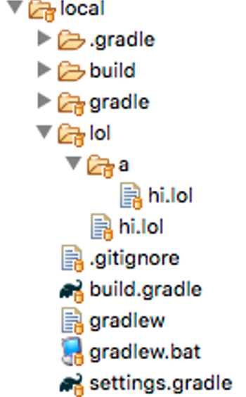

## 5.4 Supporting a new Language

My experience with build technologies comes from a common situation when working with newer technologies, which is that build and deployment automation mechanism either are not robust or are nonexistent. The result is that I have had to come up with some creative ways to automate building, testing, and deploying newer technologies.

Before Gradle there was Maven, before Maven there was Ant, and before Ant there was general scripting. Gradle has the advantage of being cross-platform compatible and can be done in a way that can be tested, from unit to functional. The same cannot be said for the bash scripting I once had to write to package a War in an RPM.

The purpose of this plugin is to demonstrate that if you can do it at the command-line, you can automate it using Gradle. The specific example uses the several strategies for command-line interaction, to automate the running of files written in the LOCLCODE language:

LOLCODE is an esoteric programming language inspired by lolspeak, the language expressed in examples of the lolcat Internet meme. The language was created in 2007 by Adam Lindsay, researcher at the Computing Department of Lancaster University.

\-    https://en.wikipedia.org/wiki/LOLCODE

#### LOLCODE in action

```
HAI 1.2
    BTW This is the famous 'Hello World' program
    VISIBLE "Hello World"
KTHXBYE

```

LOLCODE stats with HAI and ends with KTHXBYE, with a basic “Hello World” is given above.

```bash
$ lci lol/a/hi.lol
Hello World

```

A LOLCODE file is expected via the “lci” executable, which must be installed and available via the command-line.

 

#### src/main/groovy/com/blogspot/jvalenitno/gradle/LolPlugin.groovy

```groovy
class LolPlugin implements Plugin<Project> {

    void apply(Project project) {
        project.extensions.create 'lol', LolExtension
        project.task('clean', type:CleanTask)
        project.task('run', type:RunTask)
    }
}

```

The intention of the plugin it to provide a **clean** task to handle deleting the **build** directory, and a **run** task to handle running any .lol files any storing their output in the **build** directory.

#### src/main/groovy/com/blogspot/jvalenitno/gradle/LolExtension.groovy

```groovy
class LolExtension {
    String inputDir = 'lol'
    String fileExt = '.lol'
}

```

By default, the input directory expected to contain the .lol files is **lol**, with the accoeted extension being .lol.

#### src/main/groovy/com/blogspot/jvalenitno/gradle/CleanTask.groovy

```groovy
class CleanTask extends DefaultTask {

    CleanTask instance = this

    @TaskAction
    void perform() {
        println "- Deleting ${instance.project.buildDir}"
        FileUtils.deleteDirectory(instance.project.buildDir)
    }
}

```

The standard output location for a Graldle build is “build,” however this location will be not created and cleaned on its own in plugin. Fo rthis reason, a **clean** task is provided that handles deleteing the “build” directory.

#### src/main/groovy/com/blogspot/jvalenitno/gradle/RunTask.groovy

```groovy
class RunTask extends DefaultTask {

    RunTask instance = this

    @TaskAction
    void perform() {
        Project p = instance.project

        LolExtension ex =
                p.extensions.findByType(LolExtension)

        println "- Output to ${p.buildDir}"
        p.buildDir.mkdirs()

        File inputDir = new File(ex.inputDir)
        println "- Input from ${inputDir.absolutePath}"

        List<LolFile> files = instance.generateFileList(
                p, p.buildDir, inputDir, ex.fileExt)
        
        instance.processFiles(files)
    }

```

**Lines 19-22: Project extension**

The strategy of using a self-reference that can be later mocked to obtain the project and its extension is used. 

 

**Line 25: build dir**

The build directory is not guaranteed to exist, so we create it before continuing.

 

**Lines 27-31: Getting the files**

Obtaining the LOL files for later execution was delegated to a method.

 

**Line 33: Execution**

The list of LOL files are given to another method to handle execution and output.

```groovy
    void processFiles(List<LolFile> files) {
        boolean isWindows = OsUtil.isWindows()

        for (LolFile file : files) {
            List<String> commands = instance.generateCommand(
                    isWindows, file)
            Command result = instance.executeCommand(commands)

            file.outputFile.parentFile.mkdirs()

            String status = 'PASS'
            if (result.error != null) {
                status = 'FAIL'
                file.outputFile.text = result.error
            } else {
                file.outputFile.text = result.output
            }

            println "- [${status}] ${file.inputShortName} " +
                    "-> build/${file.inputShortName}.txt"
            println "   > STDOUT: ${result.output}"
            println "   > STDERR: ${result.error}"
        }
    }

```

**Line 37: OS detection**

The same strategy is used as in the command-line example for OS detection. Since the Gradle system class cannot be mocked, the single operation has been abstracted into its own class with the intention of mocking the class.

 

**Lines 40-41: Command generation**

 It is recommended to separated command generation from execution. This is to make it either to test, and easier to change later.

 

**Line 42: Command execution**

The command-line execution has been delegated to another method, so the output and other relevant information can be captured.

 

**Lines 46-57: Handling the command result**

Command-line execution can result in an input stream and an error stream. Have content in the error stream is one method for determining if there is an issue, though the most reliable way is looking for a non-zero exit code of the ran process. For each LOL executed, the output is written to an output file.

```groovy
    List<LolFile> generateFileList(Project p, File buildDir, 
        File inputDir, String fileExt) {
        
        List<LolFile> files = []
        FileTree tree = p.fileTree(inputDir) { include "**/*${fileExt}" }

        tree.files.each { File f ->
            String dirDiff = f.absolutePath.replace(
                inputDir.absolutePath, '')

            File outputFile = 
                new File("${buildDir.absolutePath}${dirDiff}.txt")

            LolFile file = new LolFile(
                    inputFile:f,
                    outputFile:outputFile,
                    inputShortName:dirDiff[1..-1])

            files.add(file)
        }

        files
    }

```

**Line 65: FileTree**

A **FileTree** is used to recursively find all LOL files in the input directory.

 

**Line 67: The file loop**

Just as in the File example, **tree.files.each** is used in place of **tree.each**. This is so the content can be later mocked.

 

**Line 68-72: Maintaining relative path**

The concept is to put the file from the input directory in the same directory structure in the output directory. For example, input/a/b/c.lol results in build/a/b/c.txt. This was accomplished by deriving the relative location by removing the input directory path from the current file, then prepending that to the output file.

 

```groovy
    Command executeCommand(List<String> commands) {
        Command c = new Command()

        ByteArrayOutputStream stdout = new ByteArrayOutputStream()
        ByteArrayOutputStream sterr = new ByteArrayOutputStream()

        try {
            instance.project.exec {
                commandLine commands
                standardOutput = stdout
                errorOutput = sterr
            }

            c.output = stdout.toString().trim()
        } catch (e) {
            c.error = sterr.toString().trim()
        }
        c
    }

```

**Lines 85-103: Command-line**

The same strategy used in the command-line example is used here. The self-reference is used obtaining the project, so that the project value can be mocked. The command-line output and error output are then written to streams, which are then converted to String.

```groovy
    List<String> generateCommand(boolean isWindows, LolFile file) {
        List<String> commands = []

        if (isWindows) {
            commands.add('cmd')
            commands.add('/c')
        }
        commands.add('lci')
        commands.add(file.inputFile.absolutePath)

        commands
    }

```

**Lines 105-115: Command generation**

Based on whether the running OS is Windows or not, the command is generated for running **lci** on the given file.

 

#### plugin-tests/local



Setting up a manual test results placing LOL file in the input directory.

 

#### plugin-tests/local/lol/hi.lol

```
HAI 1.2
    BTW This is the famous 'Hello World' program
    VISIBLE "Hello World"
KTHXBYE

```

This file purposes contains a compile error, so that was can verify the error behavior.

 

#### plugin-tests/local/lol/a/hi.lol

```
HAI 1.2
    BTW This is the famous 'Hello World' program
    VISIBLE "Hello World"
KTHXBYE

```

This is the “Hello World” example for earlier, that will success and result in the output appearing in the build directory.

 

#### plugin-tests/local/build.gradle

```groovy
buildscript {
  repositories {
	jcenter()
  }
  dependencies {
    classpath 'com.blogspot.jvalentino.gradle:custom-language:1.0.0'
  }
}

apply plugin:'lol'

lol {
    inputDir = 'lol'
    fileExt = '.lol'
}

```

The build applying the plugin only needs to specify the directory containing the LOL files, and the extension to use for finding those files.

 

#### Manual Testing

```bash
plugin-tests/local$ gradlew clean run --stacktrace

> Task :clean 
- Deleting /custom-language/plugin-tests/local/build

> Task :run 
- Output to /custom-language/plugin-tests/local/build
- Input from /custom-language/plugin-tests/local/lol
- [PASS] a/hi.lol -> build/a/hi.lol.txt
   > STDOUT: Hello World
   > STDERR: null
- [FAIL] hi.lol -> build/hi.lol.txt
   > STDOUT: null
   > STDERR: /custom-language/plugin-tests/local/lol/hi.lol:3: unknown token at: s"Hello


BUILD SUCCESSFUL

```

When running the tasks for **clean** and then **run**, the build directory will be deleted, the first file will pass and return “Hello World”, while the second file will fail due to the listed compile error.

#### src/test/groovy/com/blogspot/jvalenitno/gradle/RunTaskTestSpec.groovy

```groovy
class RunTaskTestSpec extends Specification {

    @Subject
    RunTask task
    Project project
    ExtensionContainer extensions

    def setup() {
        Project p = ProjectBuilder.builder().build()
        task = p.task('run', type:RunTask)
        task.instance = Mock(RunTask)
        project = Mock(ProjectInternal)
        extensions = Mock(ExtensionContainerInternal)
        FileUtils.deleteDirectory(new File('build/output'))
    }
    
    def cleanup() {
        FileUtils.deleteDirectory(new File('build/output'))
    }

```

**Lines 20-36: Standard setup and cleanup**

The standard setup for a task is used, involving an extension and the relying to writing files to the file system. The self-reference technique is used to mock the project, so it can mock the extension container to return the extension. Since the test will be writing to the build directory, handle deleting that directory before and after each test to present tests from interfering with one another.

```groovy
    void "test perform"() {
        given:
        LolExtension ex = new LolExtension()
        File buildDir = Mock(File)
        List<LolFile> files = [new LolFile()]

        when:
        task.perform()

        then:
        _ * task.instance.project >> project
        1 * project.extensions >> extensions
        1 * extensions.findByType(LolExtension) >> ex

        and:
        _ * project.buildDir >> buildDir
        1 * buildDir.mkdirs()

        and:
        1 * task.instance.generateFileList(
                project, buildDir, _, ex.fileExt) >> files

        and:
        1 * task.instance.processFiles(files)
    }

```

**Lines 38-61: Test perform**

​      The use of the self-reference strategy for other method interaction has made this method simple to test. It is just the overall flow, which creates the build directory, generates the file list, and processes those location files. Since the file operations don’t involve closures or read operations (using text), a mock can be used instead of relying on the file system.

 

```groovy
void "test processFiles"() {
        given:
        LolFile alpha = new LolFile(
                inputFile:new File('build/output/a.lol'),
                outputFile:new File('build/output/a.lol.txt'),
                inputShortName:'build/output/a.lol')
        Command alphaCommand = new Command(output:'blah')
        
        and:
        LolFile bravo = new LolFile(
            inputFile:new File('build/output/b.lol'),
            outputFile:new File('build/output/b.lol.txt'),
            inputShortName:'build/output/b.lol')
        Command bravoCommand = new Command(error:'boo')
    
        
        and:
        List<LolFile> files = [alpha, bravo]
        
        and:
        GroovyMock(OsUtil, global:true)

        when:
        task.processFiles(files)

        then:
        1 * OsUtil.isWindows() >> true
        
        and:
        1 * task.instance.generateCommand(
                true, alpha) >> ['ls']
        1 * task.instance.executeCommand(['ls']) >> alphaCommand
        alpha.outputFile.text == 'blah'
        
        and:
        1 * task.instance.generateCommand(
            true, bravo) >> ['ls']
        1 * task.instance.executeCommand(['ls']) >> bravoCommand
        bravo.outputFile.text == 'boo'
    }

```

**Lines 66-81: The inputs**

To test that this method will work with multiple files, two LolFile inputs are setup. Each will result in their output being written to the temporary build directory. The Command instances are meant to mock the result of the commands be executing for those files, with their output defined.

 

**Line 84: Windows or Not**

Since the OS detection relies on a class that cannot be mocked, it has been wrapped in a class than can.

 

**Line 87: Execution**

When the method under test in run.

 

**Line 90: Is Windows?**

Expect a call to **OsUtil** do determine if Windows or not.

 

**Lines 93-94: First command generation**

Expect the call to generate the command using the first file and return the command of “ls”.

 

**Lines 95-96: First command execution**

Expect the call to execute the first command, and sets the output that is supposed to be set on the output file to “blah”

 

**Lines 99-100: Second command generation**

Expect the call to generate the command using the second file and return the command of “ls”.

 

**Lines 101-102: Second command execution**

Expect the call to execute the second command, and sets the output that is supposed to be set on the output file to “boo”


```groovy
    void "Test generateFileList"() {
        given:
        File buildDir = new File('src/test/resources/output')
        File inputDir = new File('src/test/resources/input')
        String fileExt
        
        and:
        ConfigurableFileTree fileTree = 
            Mock(ConfigurableFileTree)
        fileTree.files >> [
            new File('src/test/resources/input/test.lol')
        ]
        
        when:
        List<LolFile> r = task.generateFileList(
            project, buildDir, inputDir, fileExt)
        
        then:
        1 * project.fileTree(_, _) >> fileTree
        
        and:
        LolFile file = r.get(0)
        file.inputFile.absolutePath.endsWith(
            'src/test/resources/input/test.lol')
        file.outputFile.absolutePath.endsWith(
            'src/test/resources/output/test.lol.txt')
        file.inputShortName == 'test.lol'
    }

```

**Lines 107-109: Inputs**

Direct the build and input locations to be within src/test/resources, when test files have been placed.

 

**Lines 112-116: FileTree**

Using the same strategy for mocking the **FileTree** in the Files Example, a **ConfigurableFileTree** is mocked and set to return a test LOL file.

 

**Lines 119-120: Execution**

When the method under test is executed.

 

**Line 123: FileTree returning**

Expect a call to the project to generate a **FileTree** within any parameters and return the mocked **ConfigurableFileTree**.

 

**Lines 126-131: Assertions**

Asserts that the given input file has a corresponding output file in text format.

```groovy
    void "test executeCommand"() {
        given:
        GroovyMock(ByteArrayOutputStream, global:true)
        ByteArrayOutputStream os = Mock(ByteArrayOutputStream)
        ByteArrayOutputStream er = Mock(ByteArrayOutputStream)
        List<String> commands = ['a', 'b']
        
        when:
        Command c = task.executeCommand(commands)
        
        then:
        1 * task.instance.project >> project
        1 * project.exec(_)
        1 * new ByteArrayOutputStream() >> os
        1 * new ByteArrayOutputStream() >> er
        1 * os.toString() >> 'output'
        
        and:
        c.output == 'output'
    }

```

**Lines 136-138: Output Streams**

Using the same strategy as in the Command-Line Example, the **ByteArrayOutputStream** is globally mocked, with the intention of using those mocked for the command-line input and error streams. Mocks are then created to later be used for those input and error streams.

 

**Lines 139-142: Execution**

When the method is executed with the commands of “a, b”.

 

**Line 145: Project mocking**

Uses the self-reference mocking strategy for returning the mock instance of the project.

 

**Lines 146-148: Streams**

When the project’s **exec** method is called, replaces the input and error streams with the mocks.

 

**Line 149: Output Stream**

Per the logic if the output stream returns a value when converted to String, it is considered a success.

 

**Line 152: Assertion**

Verifies that the result of the command execution is the text from the output stream.

 

```groovy
    void "test executeCommand with error"() {
        given:
        GroovyMock(ByteArrayOutputStream, global:true)
        ByteArrayOutputStream os = Mock(ByteArrayOutputStream)
        ByteArrayOutputStream er = Mock(ByteArrayOutputStream)
        List<String> commands = ['a', 'b']
        
        when:
        Command c = task.executeCommand(commands)
        
        then:
        1 * task.instance.project >> project
        1 * project.exec(_) >> { throw new Exception('foo') }
        1 * new ByteArrayOutputStream() >> os
        1 * new ByteArrayOutputStream() >> er
        1 * er.toString() >> 'output'
        
        and:
        c.error == 'output'
    }

```

**Lines 157-166: The same**

The same setup, inputs and executions as the previous test for executing a command.

 

**Lines 167-170: The exception**

Instead of returning a result from the command execution, a closure is used to throw an exception. Since the exception was throw, the error stream is converted to text instead of the output stream.

 

**Line 173: The assertion**

Asserts that the result was from the error stream’s text output.

```groovy
    @Unroll
    void "test generateCommand where windows=#isWindows"() {
        given:
        File inputFile = Mock(File)
        LolFile file = new LolFile(
            inputFile:inputFile)
        
        when:
        List<String> c = task.generateCommand(isWindows, file)
        
        then:
        _ * inputFile.absolutePath >> '/a/b.lol'
        c.toString() == result
        
        where:
        isWindows   || result
        false       || '[lci, /a/b.lol]'
        true        || '[cmd, /c, lci, /a/b.lol]'
    }

```

Tests the result of command generation, for both Windows and not Windows. The usage of the “where” clause makes the execution in the “when” clause executed twice. The “where” clause then asserts what the commands look like between those two cases.

